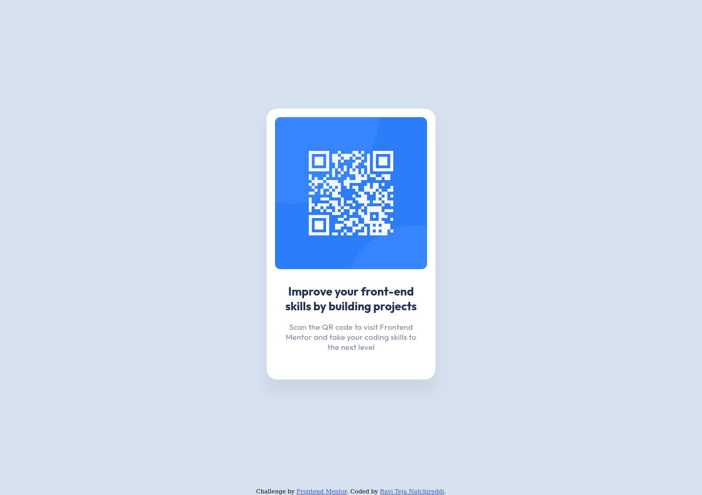

# Frontend Mentor - QR code component solution

This is a solution to the [QR code component challenge on Frontend Mentor](https://www.frontendmentor.io/challenges/qr-code-component-iux_sIO_H). Frontend Mentor challenges help you improve your coding skills by building realistic projects.

## Table of contents

- [Overview](#overview)
  - [Screenshot](#screenshot)
  - [Links](#links)
- [My process](#my-process)
  - [Built with](#built-with)
  - [What I learned](#what-i-learned)
  - [Continued development](#continued-development)
- [Author](#author)

## Overview

### Screenshot

### Links

- Solution URL: [https://github.com/daredevilteja/qr-code-component](https://github.com/daredevilteja/qr-code-component)
- Live Site URL: [https://daredevilteja.github.io/qr-code-component/](https://daredevilteja.github.io/qr-code-component/)

## My process

### Built with

- HTML
- CSS
- Flex
- Mobile-first workflow

### What I learned

I revisited some of flex concepts while building this project. Flex provides a easy way to style things and would inherently make your project mobile-friendly.

### Continued development

I want to make this project more responsive and polished. I want to make the transition of the page more smoother when the window size is changed.

## Author

- Website - [Ravi Teja Natchireddi](https://ravi-teja-natchireddi.netlify.app/)
- Frontend Mentor - [@daredevilteja](https://www.frontendmentor.io/profile/daredevilteja)
- Twitter - [@daredevilteja](https://www.twitter.com/daredevilteja)
- LinkedIn - [@raviteja-n](https://www.linkedin.com/in/raviteja-n/)
